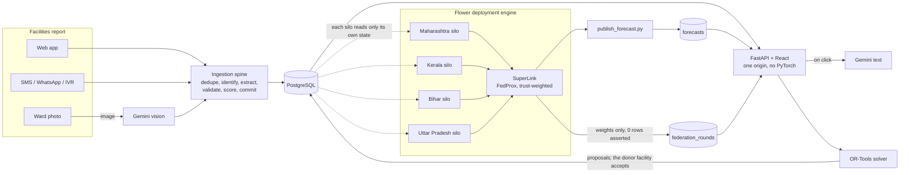

# SwasthSetu · स्वस्थसेतु

**Four states train one medicine-demand model without sharing a single facility record, and the
platform turns its forecasts into stock-out warnings and transfer proposals that a person approves.**

The track asks for *"a federated AI platform for national-scale health resource and supply chain
management"*, with *"real-time visibility into medicine stocks, bed availability and medical
personnel attendance across India's PHC network; demand forecasting; early warnings for stock-outs
during health emergencies; automated cross-district resource redistribution; and shared predictive
modelling across states."* SwasthSetu is a working prototype of exactly that loop, from a report
arriving at a primary health centre to a medicine arriving at the one that ran out.

> [!IMPORTANT]
> **All data is synthetic.** Every facility, stock figure, bed count, check-in and consignment is
> generated. Districts and coordinates are real places so the map is honest about geography, but
> no real patient or facility record exists anywhere in this system, and the schema has nowhere to
> put patient data.
>
> **Generalisation, not training.** Only four states train the model: Maharashtra, Kerala, Bihar
> and Uttar Pradesh. Forecasts shown for any other state or union territory, including
> **Lakshadweep (LD)** and **Dadra & Nagar Haveli and Daman & Diu (DH)**, are the shared model
> generalising to regions it never saw. The model reads a 28-day consumption window and calendar
> features, not a state identifier, so this is a real property of it; it is still generalisation,
> not training.

## Contents

- [Try it](#try-it)
- [How this maps to the judging criteria](#how-this-maps-to-the-judging-criteria)
- [Key features](#key-features)
- [Where Google AI does the work](#where-google-ai-does-the-work)
- [Architecture](#architecture)
- [The federated result](#the-federated-result)
- [Run it locally](#run-it-locally)
- [Tests](#tests)
- [Deploy](#deploy)
- [Privacy](#privacy)
- [Known limitations and roadmap](#known-limitations-and-roadmap)
- [Repository layout](#repository-layout)

## Try it

**<https://swasthsetu-m4x5.onrender.com>**

On the sign-in page, press **Continue →** next to **Maharashtra NHM Officer · State officer**. No
password is needed. This account sees what is happening across Maharashtra, can run the emergency
drill in the Nashik sandbox, and cannot see other states' audit queues. Officers watch transfers;
the donor facility decides them. The server enforces that, not the interface.

To see a facility's side, sign in as **Pharmacist, Nashik PHC 1**: Medicines, Orders (requests from
other centres to accept or decline), Beds and Attendance.

> [!NOTE]
> **The first load takes about a minute.** The demo runs on a free instance that sleeps when idle,
> and it applies database migrations before answering. A "Waking the server" screen shows progress;
> every page after that is immediate.

**A two-minute path:** press **Simulate emergency** on the map → watch the chain run → press
**Accept for the donor centre** → press **Confirm arrival** → open **Stocking advice (demo)** on the
outbreak panel → open **Federation**.

## How this maps to the judging criteria

| Criterion | What is in the prototype | Proof |
|---|---|---|
| **AI / Technical Execution** (25%) | Gemini reads ward photos into verified bed counts and writes the "why" behind each transfer and trust flag. A PyTorch LSTM trains across four state silos on Flower's deployment engine. | [`vision.py`](backend/app/vision.py) · [`test_explanations.py`](backend/tests/test_explanations.py) · [`test_beds.py`](backend/tests/test_beds.py) · [`checks/federation.py`](backend/checks/federation.py) (21/21) |
| **Problem-Solution Fit** (20%) | One loop covers the track: stock, beds and attendance in; forecast; early warning; a transfer proposal; a human approval; a confirmed receipt. | **Simulate emergency** button ([`liveloop.tsx`](frontend/src/liveloop.tsx)) · [`redistribution.py`](backend/app/redistribution.py) · [`test_redistribution.py`](backend/tests/test_redistribution.py) |
| **Depth & Reach** (20%) | 3,510 facilities in 157 districts across all 28 states and 8 union territories. Four state health departments train the shared model. English and Hindi throughout. | [`test_seed_geography.py`](backend/tests/test_seed_geography.py) · [`geo.py`](backend/app/geo.py) · **Federation** tab |
| **Deployability** (20%) | One Docker service; migrations run at start. Every external service has a no-credential fallback. Production refuses to boot with unsafe settings. Four roles are scoped by the server. | [`render.yaml`](render.yaml) · [`checks/platform.py`](backend/checks/platform.py) (29/29) · [`test_api_boundary.py`](backend/tests/test_api_boundary.py) · [`test_auth.py`](backend/tests/test_auth.py) |
| **Impact** (15%) | Officers see a stock-out days before it happens, and audit visits go where the records disagree rather than at random. **No figure for lives or money saved is claimed:** synthetic data cannot support one. | [`trust.py`](backend/app/trust.py) · [`test_trust.py`](backend/tests/test_trust.py) · **Data trust** tab |

## Key features

Each line says what the feature does today. Screen names are tabs in the app.

**Live national map.** Every facility is coloured by its worst medicine, with state and district
roll-ups. Days of stock come from the last 28 days of readings, or from the federated forecast when
one is fresh (`FORECAST_MODE`). Under 3 days is critical, and 3 to 7 is at risk.
<!-- screenshot: docs/screenshots/map.png -->

**Simulate emergency.** One click drops a medicine at a Nashik facility below the critical line and
carries it through the real endpoints:
1. The stock recomputes, and the rule flags the facility as critical.
2. Gemini explains the risk.
3. OR-Tools proposes a donor, and Gemini explains why.
4. **The donor centre accepts** (in the drill, you accept for it). It dispatches.
5. **The receiver confirms arrival.**
6. Both facilities' stock is shown side by side, before and after.

Stock writes stay inside the Nashik sandbox; the plan step also re-solves Maharashtra's proposals
for that one medicine. [`reset_nashik.py`](backend/scripts/reset_nashik.py) restores the sandbox.
<!-- screenshot: docs/screenshots/emergency.png -->

**Redistribution.** A min-cost-flow solver (OR-Tools, with a greedy fallback) matches surplus to
deficit. It never takes a donor below its own 14-day floor, and never plans controlled substances,
which go to a manual review list instead. Trips are grouped by vehicle run.
- **High impact** shows the ten most urgent trips that alone lift a critical facility out of
  critical.
- **Nothing is ever executed until the donor facility accepts**, which re-checks its stock at that
  moment. Officers see every trip on the dashboard but do not decide them.
<!-- screenshot: docs/screenshots/redistribution.png -->

**Two-sided medicine ledger.** A dispatch is logged at the source and the receipt is confirmed at
the destination, separately. A short or unconfirmed delivery surfaces on **Movements**, not only in
an audit. A receiver's stock rises on confirmation, not when the vehicle leaves.
<!-- screenshot: docs/screenshots/movements.png -->

**Data trust.** Six weighted rules check each facility's own signals against each other:
- attendance against patients seen
- stock movement against footfall
- the Gemini bed count against the admission register
- delivery confirmations
- implausibly smooth figures
- how much of what it reports can be verified

It is scored live, one state at a time. A low score makes that facility's stock warning trip
earlier, and ranks a searchable audit queue. It is worded as a reason to visit, never an
accusation, and it attaches to facilities, never to people.
<!-- screenshot: docs/screenshots/trust.png -->

**Bed capture.** A ward photo must show that day's rotating code.
- Gemini returns the total beds, the occupied beds and the code it reads.
- A report is marked `verified` only if the code matches and the photo's location passes the
  facility geofence.
<!-- screenshot: docs/screenshots/beds.png -->

**Federation.** Each round's row shows when it finished, its error, the exact bytes sent and a
weights hash.
- **0 facility rows transmitted** is asserted by the aggregator before each round is written.
- The size is 22,788 bytes every round because the model is 5,697 numbers × 4 bytes. The hash is
  what changes.
- **Run next round** trains one real round on the four silos. It is local only: see
  [limitations](#known-limitations-and-roadmap).
<!-- screenshot: docs/screenshots/federation.png -->

**One ingestion pipeline.** The web form, SMS in a forgiving keypad grammar (`ORS 60 ZINC 20`),
WhatsApp and IVR all normalise into the same stock reading. On the demo, phone channels run through
the built-in simulator (**Field reports**).

## Where Google AI does the work

| Google AI | What it does | Where it is load-bearing |
|---|---|---|
| **Gemini vision** (`gemini-3.1-flash-lite`) | Reads a ward photo into total beds, occupied beds and the rotating code in one pass | Bed capture. Without it, no bed report can be verified. |
| **Gemini text** (`gemini-3.5-flash-lite`) | Writes a facility's daily briefing in English and Hindi, and the "why" behind a proposed trip or a trust flag | Emergency drill steps 4 and 6, trip cards, **Data trust** |
| **Google Maps** Routes API and Map Tiles | Road distances for the solver, and the basemap | Behind `MAPS_MODE=google`. The public demo runs the tested `osm` fallback and labels those distances as straight-line estimates. |

Three rules keep the Gemini text honest, all enforced in [`vision.py`](backend/app/vision.py) and
tested in [`test_explanations.py`](backend/tests/test_explanations.py):
- **No invented numbers.** An answer containing any number that is not in its inputs is discarded.
- **No accusations.** Trust wording that reads as an accusation is discarded.
- **Honest labels.** The screen says "⚡ Gemini" only when the model actually wrote the text, and
  "Rule-based" otherwise.

Gemini runs on click, never on page load, and identical requests are cached. `vision.py` is the
only module that reaches Gemini, which [`test_api_boundary.py`](backend/tests/test_api_boundary.py)
enforces.

## Architecture



**Publishing, not serving.** The web image carries no PyTorch. Training writes predictions into
`forecasts` and the API only reads rows, so a bad training run falls back to the burn-rate rule
instead of breaking the dashboard.

| Layer | What is used |
|---|---|
| API | FastAPI, SQLAlchemy 2 (async), asyncpg, Alembic, Pydantic 2 |
| Database | PostgreSQL 17 (no PostGIS; haversine in SQL) |
| Frontend | React 19, Vite 6, TypeScript, Tailwind CSS 4, Leaflet |
| Federated learning | Flower 1.37 deployment engine (SuperLink + 4 SuperNodes), FedProx, PyTorch `DemandLSTM` |
| Optimiser | OR-Tools `SimpleMinCostFlow`, greedy fallback |
| **Google AI** | **Gemini** vision and text via `LLM_MODE`; **Google Maps** Routes and Map Tiles via `MAPS_MODE` |
| Messaging | Twilio SMS / WhatsApp / voice via `COMMS_MODE` (simulator on the demo) |
| Hosting | One Docker service on Render |

`LLM_MODE`, `MAPS_MODE` and `COMMS_MODE` each default to a mode that needs no key, so the app starts,
seeds and demos with every credential blank. Both paths stay tested.

## The federated result

A real run on Flower's deployment engine (one SuperLink and four SuperNode processes, each reading
only its own state), reproduced for this README:

| Round | MAE | Burn-rate rule, same held-out weeks | Bytes sent | Facility rows sent |
|---|---|---|---|---|
| 0 (untrained) | 1.0914 | 0.1108 | 22,788 | 0 |
| 1 | 0.0795 | 0.1108 | 22,788 | 0 |
| 3 | 0.0791 | 0.1108 | 22,788 | 0 |
| 5 | 0.0782 | 0.1108 | 22,788 | 0 |

Rounds 4 and 5 were started from the **Run next round** button. Each continued only after the saved
weights hashed to what the previous row recorded. The deployed database holds an earlier run,
recorded in [`SPEC_DIGEST.md`](docs/specs/SPEC_DIGEST.md) §5 on 2026-09-20: nine rounds, MAE 1.0674 → 0.1106
against a 0.1494 burn rate.

## Run it locally

Verified on Linux with Python 3.11, Node 22 and PostgreSQL 16. The project targets Python 3.13 and
PostgreSQL 17. On Windows use `.venv\Scripts\` in place of `.venv/bin/`.

```bash
git clone https://github.com/AdityaChandel11/LESSGOO.git && cd LESSGOO
cp .env.example .env    # set the password in DATABASE_URL to your local Postgres password
createdb phc            # the database the default DATABASE_URL points at
```

```bash
cd backend
python -m venv .venv && .venv/bin/pip install -r requirements-dev.txt
.venv/bin/alembic upgrade head
.venv/bin/python -m scripts.seed --days 28 --focus-days 60 --yes   # a smaller seed; about a minute
.venv/bin/python -m scripts.trust
.venv/bin/python -m scripts.users demo      # prints the demo password
.venv/bin/uvicorn app.main:app --port 8000
```

```bash
cd frontend && npm ci && npm run dev        # http://localhost:5173
```

To see Gemini live, set `LLM_MODE=live` and `GEMINI_API_KEY` in `.env`, then check the key with
`python -m scripts.check_gemini`. Federated training is optional; its four-process setup is in
[`backend/federation/README.md`](backend/federation/README.md).

## Tests

```bash
cd backend
.venv/bin/python -m pytest -q     # 418 unit tests
.venv/bin/python -m checks        # 201 integration assertions, 9 suites, against the seeded database
cd ../frontend && npx tsc -b && npm run build
```

The check suites assert behaviour end to end, including that:
- a provider retry cannot double-count
- a stale bed photo is rejected
- a donor is never drained below its floor
- a controlled substance is never offered a donor
- no facility row crosses a silo boundary

The federation suite needs `FEDERATION_PYTHON` set to the Flower environment's interpreter, and
forecasts published once.

## Deploy

This is the path the live demo was deployed with. It was not re-run for this README.

1. Create a PostgreSQL instance and a Docker **Web Service** from this repository in the same
   region. [`render.yaml`](render.yaml) describes the service.
2. Set the variables below in the host's dashboard. Secrets never go in the repository.
3. Deploy. The container runs `alembic upgrade head` before serving.
4. Seed through the guarded runner, which prints the target host and refuses a local one:

```bash
cd backend
.venv/bin/python -m scripts.remote --confirm -- -m scripts.seed --days 35 --focus-days 120 --yes
.venv/bin/python -m scripts.remote --confirm -- -m scripts.trust
.venv/bin/python -m scripts.remote --confirm -- -m scripts.users demo
```

| Variable | Needed | Notes |
|---|---|---|
| `DATABASE_URL` | yes | Any Postgres URL; the app corrects the driver prefix |
| `JWT_SECRET` | production | 32+ random characters; production refuses to start without it |
| `PHONE_HASH_SALT` | production | Keeps the phone registry from becoming a list of numbers |
| `GEMINI_API_KEY` | for Gemini | With `LLM_MODE=live` |
| `GOOGLE_MAPS_SERVER_KEY`, `GOOGLE_MAPS_BROWSER_KEY` | optional | With `MAPS_MODE=google` |
| `TWILIO_*` | optional | With `COMMS_MODE=live` |

The full list is in [`.env.example`](.env.example).

## Privacy

- **No patient-level data exists in the system.** India's DPDP Act 2023 is the frame.
- Phone numbers and staff identifiers are stored only as salted hashes, and the interface shows
  masked forms.
- Trust flags attach to facilities and patterns, never to a named person. This is a data-quality
  signal, not fraud detection.
- Federated learning here is **privacy-enhancing, not privacy-guaranteed**. Raw rows stay local,
  and the aggregator proves it. There is no differential privacy or secure aggregation yet.

## Known limitations and roadmap

- **Run next round is local only.** It needs the Flower processes and PyTorch, which the free web
  service cannot host. The deployed site shows the recorded rounds and says why the button is off.
- **Only four states train.** Other regions receive forecasts by generalisation (see the note at
  the top). The app does not yet label those forecasts on screen.
- **Outbreak pre-positioning is not built.** Stock-out early warning works. Weighting it by an
  active outbreak, to move supply ahead of a cluster, is designed but not implemented.
- **Voice input is not built.** Hindi labels and Gemini's Hindi briefings are live; there is no
  speech-to-text path yet.
- **The receipt-photo reader has no functional test.** The Gemini path that reads a bill or
  delivery slip into stock lines exists ([`read_stock_photo`](backend/app/vision.py)), but only its
  quota guard is tested.
- **The Gemini free tier allows 20 requests a day per model.** Heavy use falls back to the
  rule-based text, labelled as such.
- **The demo uses no Google Maps key.** Distances are straight-line × 1.3, labelled on screen.
- **Messaging runs through the simulator on the demo.** The Twilio adapters are implemented and
  signature-checked, but live sending needs an account.
- **Links are unencrypted locally.** The SuperLink and SuperNodes run `--insecure`; production
  would need TLS and SuperNode authentication.

## Repository layout

| Path | What is in it |
|---|---|
| [`backend/app/`](backend/app) | API, ingestion spine, trust rules, redistribution solver, ledger, Gemini adapter (`vision.py`) |
| [`backend/federation/`](backend/federation) | Flower ServerApp/ClientApp, the silos, the inspector, forecast publishing |
| [`backend/tests/`](backend/tests) | Unit tests (pytest) |
| [`backend/checks/`](backend/checks) | Integration checks against a seeded database |
| [`backend/scripts/`](backend/scripts) | Seed, trust, demo users, key checks, the guarded remote runner |
| [`backend/alembic/`](backend/alembic) | Database migrations |
| [`frontend/src/`](frontend/src) | Map, dashboard panels, emergency drill, federation inspector |
| [`docs/specs/`](docs/specs) | Build specifications, the spec digest and the hackathon rules |
| [`docs/planning/`](docs/planning) | Planning notes from the build |
| [`docs/STORAGE_NOTES.md`](docs/STORAGE_NOTES.md) | Measurements behind the deployed database's size rules |
| `render.yaml`, `Dockerfile` | The deployed service |
| `CLAUDE.md` | Working agreement and operational rules |
